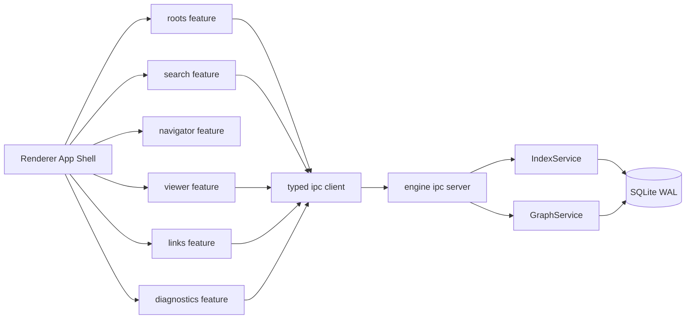

# Nodeveil Architecture (Phase 3)

## Frontend boundaries

- `features/*` are isolated by concern (no feature-to-feature imports).
- each feature has explicit state transitions (`state.ts`, `actions.ts`, `selectors.ts`, `controller.ts` as needed).
- `shared/ipc` owns retries/timeouts/cancellation.

## Backend boundaries

- `internal/service/index_service.go` for indexing lifecycle.
- `internal/service/graph_service.go` for link semantics.
- `internal/store/*` contains all SQL.

## Stability goals

- resilient reconnect behavior when engine is down.
- paged/virtualized rendering in navigator/search paths.
- diagnostics via `events_log` read model.
