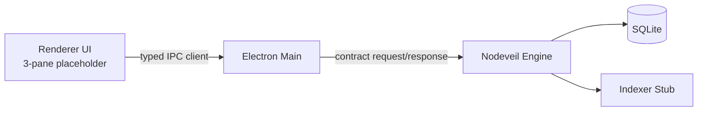

# Nodeveil Architecture (Phase 0)

## System Overview

## Module Responsibilities

- `engine/internal/graph`: pure domain model and invariants.
- `engine/internal/db`: SQLite migrations and root repository implementation.
- `engine/internal/ipc`: contract transport (Phase 0: HTTP JSON service skeleton aligned to proto contract).
- `engine/internal/app`: composition root wiring config, db, and server.
- `desktop/electron`: app lifecycle and bridge APIs.
- `desktop/renderer`: view-only state and placeholders.
- `desktop/shared`: IPC type contracts shared between renderer and main.

## Data Ownership

The engine is authoritative for graph and index metadata. Desktop stores no business-state truth and only renders responses from the engine.

## IPC Contract

Contract source: `proto/nodeveil/v1/nodeveil.proto`.
Phase 0 endpoints mirror these operations:

- `GetVersion`
- `HealthCheck`
- `ListRoots`

## Future Phase Boundaries

Not in Phase 0:

- Real filesystem indexer
- Link extraction/parsing pipeline
- Conflict resolution, sync, or plugin runtime
- Production packaging/signing
