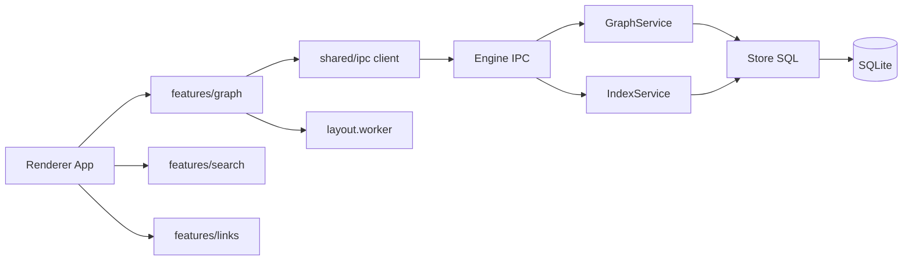

# Nodeveil Architecture (Phase 4)

## Graph feature boundaries

- `features/graph/state.ts`: explicit graph state and reducer.
- `features/graph/controller.ts`: IPC requests, cancellation, worker orchestration.
- `features/graph/engine/*`: renderer/layout/picking internals.
- `features/graph/workers/layout.worker.ts`: off-main-thread layout.

## Engine additions for graph view

- `GET /graph/neighborhood` with depth/filter/limit/cursor caps.
- `GET /graph/counts` for fast degree read model.
- stable and bounded response sizes to avoid runaway graphs.
