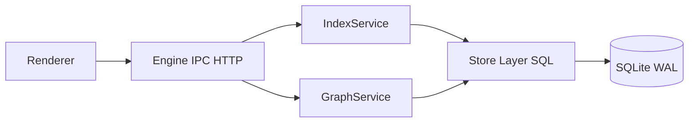

# Nodeveil Architecture (Phase 2)

## Responsibilities

- `internal/domain`: index + graph domain models.
- `internal/indexer`: scan/watch/reconcile event sources.
- `internal/store`: all SQL for nodes/edges/roots/events.
- `internal/service/index_service.go`: indexing orchestration.
- `internal/service/graph_service.go`: graph invariants, export/import.
- `internal/ipc`: request handlers for indexing + graph APIs.

## Invariants

- No self-loop edges.
- No duplicate live edge for same `(from,to,relation_type)`.
- Edges refer to existing live nodes.
- Node soft-delete cascades edge soft-delete.

## Not in Phase 2

- Full graph rendering
- AI inference
- Cloud sync
